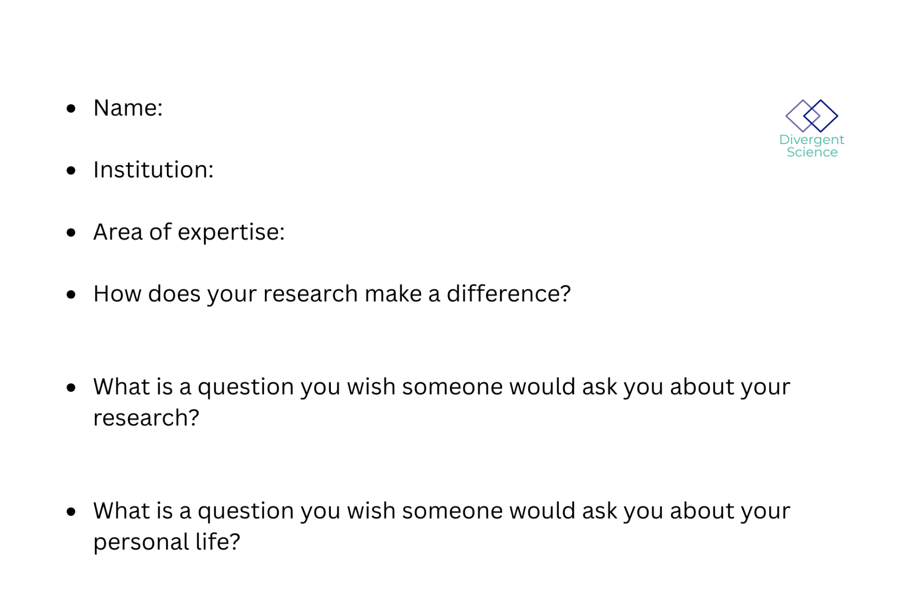
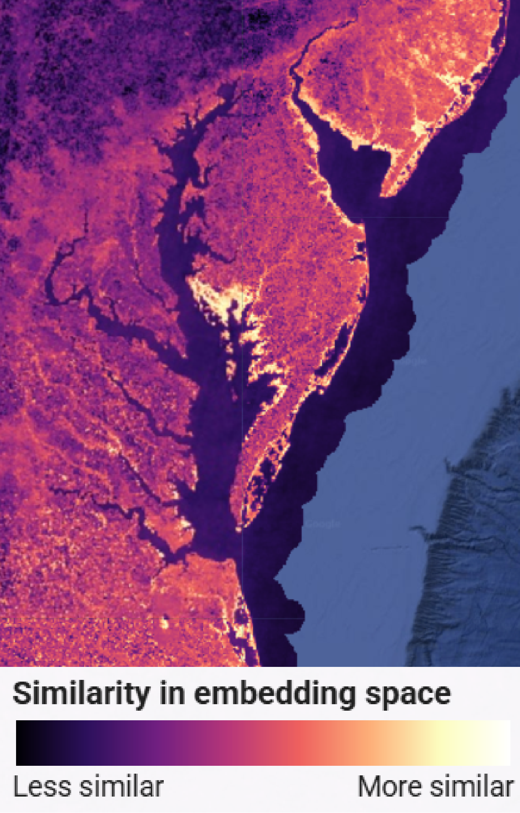

!!! tip "How to use this page during the Summit"
    - This page is your team’s shared workspace and final report-out page. It captures your group’s process and thinking throughout the Summit and will be used to share your work with others. 
    
    - Use this page as your team’s working record during the Summit and your final report-out.
    
    - The Summit has several different goals and thus you will use the page differently each day: Day 1 is for alignment, Day 2 is for building one useful thing, and Day 3 is for synthesis and report- out.
    
    - Look for the green buttons to indicate what you need to edit. 
    
    - Megaphones 📣 indicate which items you will be presenting during the end-of-day report-outs.

    - Only the items with megaphones will be visible when you hit the 'Summit Report Out' button. 

    - If you turn off 'Instructions' then you will only see the page content for public display.
    

# Embedders (depth)

!!! note "Day 1 directions"
    Change the title to the name of your project.

    [Edit Day 1 setup in Markdown](https://github.com/CU-ESIIL/Summit_group_2026_5/edit/main/docs/index.md?plain=1#L21){ .md-button target="_blank" rel="noopener" }

!!! tip "For ESIIL staff"
    Group Number: 5
    
    Breakout Room #: S348

    [ESIIL staff edit in Markdown](https://github.com/CU-ESIIL/Summit_group_2026_5/edit/main/docs/index.md?plain=1#L28){ .md-button target="_blank" rel="noopener" }
    

!!! note "How to replace the image above"
    Upload an image that represents your project and welcome people to your page. 
    
    Upload your own image to `docs/assets/hero/` and replace the file named `hero.png`. Use a wide image if you can, then refresh the site preview to check how it looks.
    Keep the file path `docs/assets/hero/hero.png` if you want the Markdown above to keep working.

    [Open image folder for changing image](https://github.com/CU-ESIIL/Summit_group_2026_5/tree/main/docs/assets/hero){ .md-button target="_blank" rel="noopener" }

[See a completed example](example.md){ .md-button }

## People { #people .oasis-report-out-context }

!!! note "Day 1 task"
    Get to know your team: share your cards (5-7 mins). Update your team roster (2-3 min).

    Use the in-person name cards to guide quick introductions.

    | Name card prompts | Follow-up notes |
    |---|---|
    |  |  |

    [Edit People in Markdown](https://github.com/CU-ESIIL/Summit_group_2026_5/edit/main/docs/index.md?plain=1#L63){ .md-button target="_blank" rel="noopener" }

| Name | Affiliation | Contact | Github |
|---|---|---|---|
| Dusty Gannon | Oregon State University | dustin.gannon@oregonstate.edu | Dusty-Gannon |
| Keqi He | Virginia Institute of Marine Science | khe@vims.edu | hkqcqq |
| Annie Taylor | The Nature Conservancy | annie.taylor@tnc.org | annietaylor |
| Levi "Veevee" Cai | Univ. of Colorado, Boulder | levi.cai@colorado.edu | arizonat |
| Brian Lee | Univ. of Colorado, Boulder | brian.lee-4@colorado.edu | bhyleee |
| Matthew Helmus | Temple University | mrhelmus@temple.edu | mrhelmus |
| Ria Gupta |---|---|---|

## Team Norms and Decision Making { #team-norms-and-decision-making }

| Gradients of agreement | |
|---|---|
| Love it! ❤️ | one finger |
| Like it 👍 | two fingers |
| Live with it 🤷‍♀️ | three fingers |
| Loathe it 🚫 | four fingers |

    [Edit Team Norms in Markdown](https://github.com/CU-ESIIL/Summit_group_2026_5/edit/main/docs/index.md?plain=1#L87){ .md-button target="_blank" rel="noopener" }

Our team norms:

- Single slack channel, communicate over slack by @ing.
- Some test cases (depth) may illustrate the inventory (breadth) group, but they do not have to be shared in the larger paper (it is okay to keep your case study independent)
- Step up, step back / even turn taking

AI norms:

- Research/exploration
- Code snippets and claude code/codex/copilot ok (don't give sensitive data)
    - Prefer claude, gemini, cyverse and copilot with anthropic activated, if possible
- Editing/polishing/reviewing work (read after the edit)
- Create documentation like READMEs
- Not for first pass writing of papers

Our decision making strategy:

- Call for vote
- Hold fingers up to indicate agreement on scale above

## Our product(s) 📣 { #product-direction .oasis-report-out-section .oasis-report-out-day2 }

    [Edit content below here in Markdown](https://github.com/CU-ESIIL/Summit_group_2026_5/edit/main/docs/index.md?plain=1#L106){ .md-button target="_blank" rel="noopener" }

Short term:

Library of notebooks illustrating different use cases and workflows.

Long term:

- Comparison of different embeddings across use cases and comparison to traditional ML approaches
- Test case specific products including:
      - Benchmarking toolkit
      - Site selection tool
      - Domain-specific papers

*Morning whiteboard or notes showing the question, hypotheses, and context we used to start Day 2.*

## Our question(s) 📣 { #project-question .oasis-report-out-section .oasis-report-out-day2 }

Our working question:

- Brian:

- Matthew: Risk mapping of a novel pest

- Dusty: Counterfactual / control site selection based on similarity in embedding space

- Annie: Predicting plastic mulch use across space

- Keqi: "Ghost forest" land cover classification using embedding features

- Veevee: Tool development for evaluating foundation models for specific tasks

What would count as progress:

## Why this matters (the “upshot”) 📣 { #why-this-matters .oasis-report-out-section .oasis-report-out-day2 }

**This matters because**:
- Embeddings could help with generalizability, reproducibility, and simplifying workflows, but we still need to know when and where they work well and when and where they don't.

**People who could use this**:

- Land managers
- Environmental data scientists
- Embeddings developers

## Data sources we’re exploring 📣 { #data-exploration .oasis-report-out-section .oasis-report-out-day2 }

Promising data sources:

- [Data source 1](#): [HJA Andrews Experimental Forest](https://andrewsforest.oregonstate.edu/data/map)
- [Data source 2](#): [Ag Plastics Data](https://zenodo.org/records/18500698)
- [Data source 3](#): [Lantern fly data](https://github.com/ieco-lab/lydemapr)
- [Data source 4](#): Brian's data

## Methods/technologies we’re testing 📣 { #methods-and-code .oasis-report-out-section .oasis-report-out-day2 }

!!! note "methods"
    Add 2-4 methods/technologies we're testing (stats, models, viz).

[View shared code](https://github.com/CU-ESIIL/Summit_group_2026_5/tree/main/code){ .md-button }

Methods/technologies we are testing:

| Method or technology | What we tested | Early note |
|---|---|---|
| AlphaEarth | ... | ... |
| Prithvi | ... | ... |
| MOSAIKS | ... | ... |
| ... | ... | ... |

### Challenges identified

- ...
- ...

### Visuals

Potential "Ghost Forest" locations (Similarity Analysis using Alpha Earth)

### Next Steps

Short term: 

Long term: 

!!! note "Day 3 Tasks"
    Sythesis: highlight 2-3 visuals that tell the story; keep text crisp. Practice a 6-minute walkthrough of the homepage. Why -> Questions -> Data/Methods -> Findings -> Next 

    [Edit content below here in Markdown](https://github.com/CU-ESIIL/Summit_group_2026_5/edit/main/docs/index.md?plain=1#L203){ .md-button target="_blank" rel="noopener" }

## Team Photo { #team-photo }

*Team members and collaborators who contributed to this project.*

## Findings at a glance 📣 { #findings-at-a-glance .oasis-report-out-section .oasis-report-out-day3 }

Headline 1 — what, where, how much

...

Headline 2 — change/trend/contrast

...

Headline 3 — implication for practice or policy

...

## Visuals that tell a story 📣 { #story-visuals .oasis-report-out-section .oasis-report-out-day3 }

*Visual 1: the main pattern or output we want people to remember.*

## What’s next? 📣 { #whats-next .oasis-report-out-section .oasis-report-out-day3 }

Short term:

- ...

Long term:

- ...

Who should see this next

- ...

## Cite & Reuse { #cite-reuse }

If you use these materials, please cite:

Summit Team. (2026). *Summit Group 2026 Team 5 — Innovation Summit 2026*. https://github.com/CU-ESIIL/Summit_group_2026_5

License: CC-BY-4.0 unless noted. 
